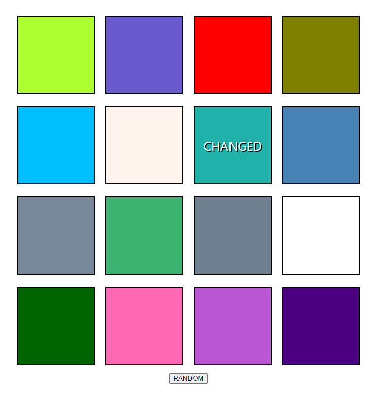

# React-ColoredBoxes
This app is a small test of handling state control in a React app. It generates a set of boxes with random colors saved in "state." You can click the "Random" button to change a random box to a random color. The box that was changed will display "CHANGED", which will be removed and shown on the next box that gets changed.

  

# Running the App

## Clone repo:
`git clone https://github.com/mpike91/React-ColoredBoxes.git`
## Move into directory:
`cd React-ColoredBoxes/`
## Install npm:
`npm install`
## Start app:
`npm start`
